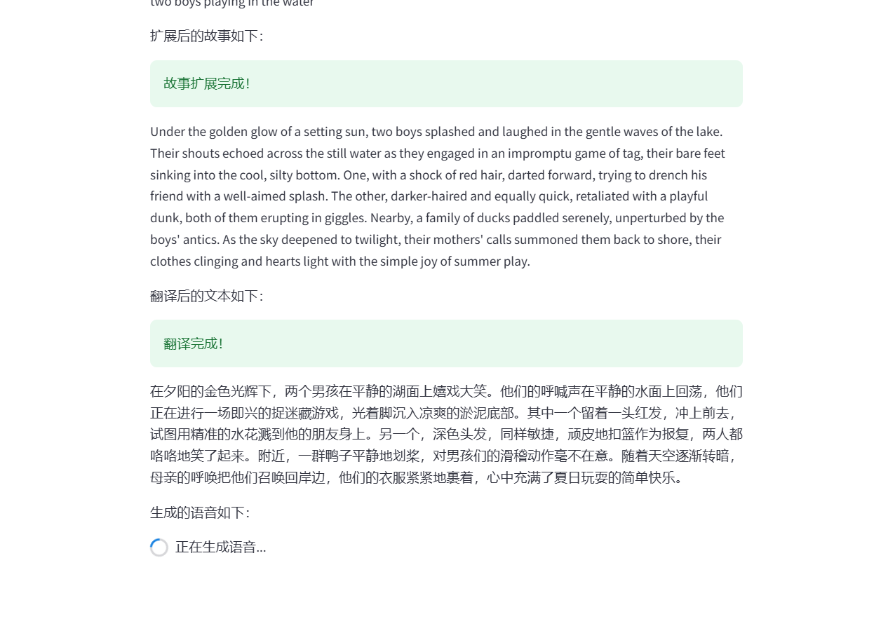

# **AI_Lesson: Listen to the Story Behind the Picture**  
# **坤坤给你讲故事**

本项目旨在通过图片生成故事，并支持语音合成播放，让您体验图像背后的故事。

---

## **安装与运行指南**

### **1. 环境配置**
1. **确保安装以下依赖：**
   - Python 3.8（强烈建议）  
   - [Conda](https://docs.conda.io/projects/conda/en/latest/user-guide/install/index.html)  
   - 所有依赖库详见 `requirements.txt` 文件。CUDA选择作者所给11.6，11.7会有兼容问题

2. **安装依赖：**
   打开终端并运行以下命令：
   ```bash
   pip install -r requirements.txt
   ```

3. **激活 Conda 环境：**
   根据您配置的环境名称运行以下命令：
   ```bash
   conda activate your_environment_name
   ```

### **2. 项目目录**
进入项目目录：
```bash
cd /your_AI_Lesson_absolute_path
```

### **3. 启动应用**
通过 Streamlit 启动应用：
```bash
streamlit run app.py
```

### **4. 上传图片**
启动成功后，您可以上传图片进行处理。

---

## **首次运行注意事项**
1. **初次运行问题**  
   如遇到提示，直接按回车键即可。以下为常见首次运行提示截图：  
   

2. **界面展示**  
   - 以下是界面加载成功的截图：  
     

   - 拖入任意一张图片后，效果如下：  
       
     

3. **音频生成与播放**  
   - 音频生成过程中会即时播放，完成后您可选择下载或再次播放：  
     

---

## **项目使用说明**

### **1. 图片转文本模型**
本项目使用了 [blip-image-captioning-base](https://huggingface.co/Salesforce/blip-image-captioning-base/blob/main/pytorch_model.bin) 模型，支持在线调用与本地部署两种方式。

### **2. 文本转语音模型**
项目集成了 [VITS-fast-fine-tuning](https://github.com/Plachtaa/VITS-fast-fine-tuning) 模型：  
- **训练说明**  
  - 使用作者提供的预训练模型，在 WSL 系统中训练了 100 个 epoch。  
  - 效果一般，但推理框架详见 `KUN_script`，需自备 `model/G_latest.pth` 和 `model/config.json` 文件。  

- **模型部署**  
  - 模型作者已提供 WebUI 整合包，更多信息可参阅其[官方文档](https://github.com/Plachtaa/VITS-fast-fine-tuning)。

---

## **注意事项**
- 本项目中的部分功能（如语音合成）需要依赖特定系统环境或文件。请确保按照上述说明准备所需资源。
- 项目久远，Windows 部署兼容性较差，colab训练约50个epochg会被掐，若能本地训练，推荐使用 Linux 或 WSL 部署。

---

## **致谢**
感谢上述开源模型的团队
感谢您对本项目的关注与支持！  

---